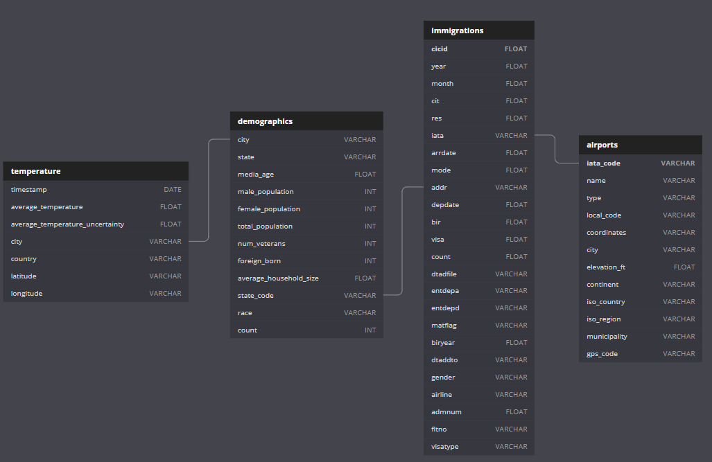

> by Filipe Macedo 01 June 2021

# CapstoneProject

This projects aims to enrich the US I94 immigration data with further data such as US airport data, US demographics and temperature data to have a wider basis for analysis on the immigration data.

## Data sources

### I94 Immigration Data
This data comes from the US National Tourism and Trade Office. A data dictionary is included in the workspace. [This](https://travel.trade.gov/research/reports/i94/historical/2016.html) is where the data comes from. There's a sample file so you can take a look at the data in csv format before reading it all in.

### World Temperature Data
This dataset came from Kaggle. You can read more about it [here](https://www.kaggle.com/berkeleyearth/climate-change-earth-surface-temperature-data).

### U.S. City Demographic Data
This data comes from OpenSoft. You can read more about it [here](https://public.opendatasoft.com/explore/dataset/us-cities-demographics/export/).

### Airport Code Table
This is a simple table of airport codes and corresponding cities. It comes from [here](https://datahub.io/core/airport-codes#data).

## Data cleaning

* Filter temperature data to only use US data.
* Remove irregular ports from I94 data.
* Drop rows with missing IATA codes from I94 data. We need the IATA codes to join the data with other sources.

## Conceptual Data Model

### Tables:
| table name | columns | description | type |
| ------- | ---------- | ----------- | ---- |
| airports | iata_code - name - type - local_code - coordinates - city | stores information related to airports | dimension table |
| demographics | city - state - media_age - male_population - female_population - total_population - num_veterans - foreign_born - average_household_size - state_code - race - count | stores demographics data for cities | dimension table |
| immigrations | cicid - year - month - cit - res - iata - arrdate - mode - addr - depdate - bir - visa - coun- dtadfil - visapost - occup - entdepa - entdepd - entdepu - matflag - biryear - dtaddto - gender - insnum - airline - admnum - fltno - visatype | stores all i94 immigrations data | fact table |
| temperature | timestamp - average_temperature - average_temperatur_uncertainty - city - country - latitude - longitude | stores temperature information | dimension table |

### Table decision

We want to have the immigrations data to store the key information. We can then enrich the data with airports, demographics and temperature data. To do so efficiently, we need identifiers on all tables so they can be joined efficiently. This includes the city and the iata code. Using a snowflake schema.

## Mapping Out Data Pipelines

1. Create tables by executing `create_tables.py`.
2. Join city to airports data.
3. Insert data.

## Choice of tools and technologies for the project

Pandas is used to ease data preprocessing and visualisation. It is helpful to efficiently load and manipulate data. At a later stage, instead of pandas dataframes, I recommend using Spark dataframes to allow distributed processing using for example Amazon Elastic Map Reduce (EMR). Also, to perform automated updates, I recommend integrating the ETL pipeline into an Airflow DAG.

I used a Jupyter Notebook to show the data structure and the need for data cleaning. Python is an often used programming language and was used because it is the language I am the most comfortable with.

## How often the data should be updated and why

The I94 data described immigration events aggregated on a monthly base. Thus, updating the data on a monthly base is recommended.

## FAQ: What would I do if...
* The data was increased by 100x.
  * Use Spark to process the data efficiently in a distributed way e.g. with EMR. In case we recognize that we need a write-heavy operation, I would suggest using a Cassandra database instead of PostgreSQL.
* The data populates a dashboard that must be updated on a daily basis by 7am every day.
  * Use Airflow and create a DAG that performs the logic of the described pipeline. If executing the DAG fails, I recommend to automatically send emails to the engineering team using Airflow's builtin feature, so they can fix potential issues soon.
* The database needed to be accessed by 100+ people.
  * Use RedShift to have the data stored in a way that it can efficiently be accessed by many people. Also, we can use a database such as PostgreSQL in a more cost-efficient setting that will, however, have slightly lower performance due to its nature.

### Data Dictionary  

#### Immigration 

| Field          | Desciption                     |
| -------------- | ------------------------------ |
| cicid          | Individual Number of Immigrant |
| year           | Year of Arrival                |
| month          | Month of Arrival               |
| i94res         | Residency Code                 |
| iata           | Port of Arrival                |
| arrdate        | Date of Arrival                |
| depdate        | Departure Date                 |
| bir            | Age of Immigrant               |
| dtadfile       | Datefield as Character         |
| entdepa        | Arrival Flag                   |
| entdepd        | Departure Flag                 |
| biryear        | Year of Birth of Immigrant     |
| gender         | Gender of Immigrant            |
| airline        | Airline of Arrival             |
| visatype       | Type of Visa                   |
| Origin_Country | Country of Origin              |
| Travelmode     | Mode of Travel                 |
| Destination    | State of Destination           |
| visatype           | General Visa Type              |

### Airport 

| Field        | Description              |
| ------------ | ------------------------ |
| iata_code    | Identity Code of Airport |
| type         | Type of Airport          |
| name         | Name of Airport          |
| elevation_ft | Elevation in Feet        |
| city         | City                     |
| iso_country  | Country Code             |
| iso_region   | Region Code              |
| municipality | Municipality Code        |
| gps_code     | GPS Code                 |
| iata_code    | IATA Code                |
| local_code   | Local Code               |

### Demographics 

| Field                             | Descritpion                       |
| --------------------------------- | --------------------------------- |
| city                              | City Name                         |
| state                             | State Name                        |
| media_age                        | Median Age in City                |
| male_population                   | Number of Male Population         |
| female_population                 | Number of Female Population       |
| total_population                  | Number of Total Population        |
| num_veterans                | Number of Veterans                |
|foreign_born | Foreign Born Number|
| average_household_size            | Average Size of Household         |
| state_code                        | Code of state                     |
| race | Number of People belongig to Race |

### Temperature 

| Field                              | Descritpion                                     |
| ---------------------------------- | ----------------------------------------------- |
|timestamp | Time of the measurement|
|average_temperature | Avarage temperature|
|average_temperature_uncertainty | Avarage temperature uncertainty|
| city                               | City Name                                       |
|country | Country |
|latitude| Map Latitude |
|longitude| Map Longitude |